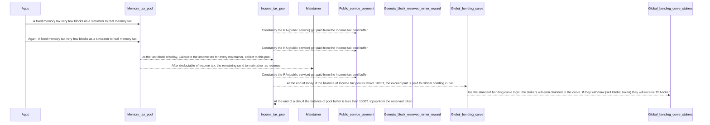

# Why do we need to test Global harberger tax in epoch10?
The top purpose of epoch10 is migrating most logic to layer2, but we can (if possible) also test the harberger tax as a new business model.

The whole billing system is complex, we do not expect to have it ready in epoch10, but we can have a minimized placeholder version in epoch10 that end user can see some of the UI, but the data is not accuracy. Note, even the features in this file may not need to be there at the beginning of epoch10, they can join in the middle.

# What we can compromise in epoch10?
## Memory tax
We can give a constant tax value every block that charged from tappstore, marketplace and teaparty. We can set three different const value. This const value will be replaced in future epoch with the real billing result. We do not have billing system ready yet, so use a const value as a placeholder.

At this moment, we did not design the tappstore or marketplace to charge the end user, so we will use public service fund to support those two apps. But for the tea party, it has its own revenue model, it should pay on its own.

## Global txn fee
We can ignore this transaction fee for now. So there is only memory tax is used in epoch10

# What we should include?
## Payment of Memory tax
we can charge every block a const value as placeholder. The tax is stored in a temp (Global pool) account after collected. 
## Buy/Sell/Suspend Global maintainer
Allow the Global maitainer (A CML) in marketplace. The status, the buy/sell/update price
## Calculate maintainer income tax
use a const tax rate 1% multiply the self estiamte price.
## Distribute the revenue to the maintainer
Revenue is the (total memory tax / total number of active maintiner) - (this maintainer self estamate * 1%)

This is a daily cron job, runs once a day at a block height that triggered around midnight.

The revenue is sent from the Global pool temp account to each maintainer daily.

## Collect maintainer income tax to a temp pool
The income tax is stored to a temp pool for one day. 
the temp pool has a minimal balance, we can set it to 1000T. 
At the end of a day, if the balance of the pool is above 1000T, the exceed part will be sent to the Bonding curve for dividend.
If the balance is lower than 1000T, we will need to take the fund from Reserved Miner Reward to topup the balance to 1000T. 

Using this method, we can make the public service get paid instantly since the 1000T is used as buffer.

## Pay public service (RA) from the pool
As the pool has 1000T buffer balance(this buffer will be refill every day), we can pay the public service (RA) immediately from this pool

# Fund flow at this stage

