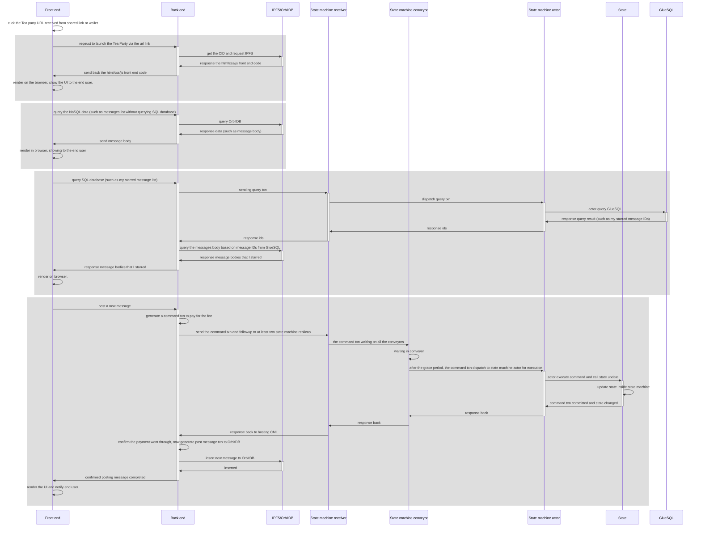

# TEA Party TApp Intro

## The goal of TEA Party
We built the TEA Party TApp to show: 

- What a typical [web3](070_What_makes_a_Web3_application.md) looks like (we call them **TApps**).

- The building blocks of a typical TApp.

- How to use Tea Party as a boilerplate to build your own TApps.

The TEA Party TApp is a useful social media application. Users can post messages to a public board as well as send private messages with notifications. See [the TEA Party user guide](030_how_to_use_TEA_Party.md) for more information.

## Basic workflow
In this section, we'll learn the basic workflow between all three tiers: how a user action get processed from the front-end to the state machine layer and back to the user.

## The magical Proof of Time state machine
In this section, we'll explain how the distributed state machine works, including how it handles consensus among different replicas.
Keep reading about the [magic of the state machine](080_magic_of_state_machine.md).

## Understand WebAssembly Runtime
You can learn more about how the WebAssembly code runs inside the [[mini-runtime]] by reading about the [[magic_of_wasm]].