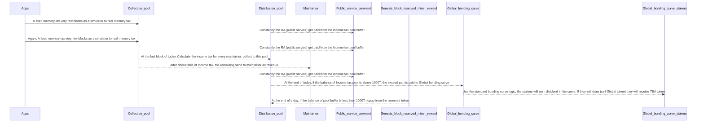

# Why do we need to test harberger tax to the Maintainer Seats in epoch10?
The top purpose of epoch10 is migrating most logic to layer2, but we can (if possible) also test the harberger tax as a new business model.

The whole billing system is complex, we do not expect to have it ready in epoch10, but we can have a minimized placeholder version in epoch10 that end user can see some of the UI, but the data is not accuracy. Note, even the features in this file may not need to be there at the beginning of epoch10, they can join in the middle.

# What we can compromise in epoch10?
## Memory tax set to fixed number as placeholder
We can give a constant tax value every block that charged from tappstore, marketplace and teaparty. We can set three different const value(three values for TAppStore, Tea party and Maketplace, our three existing tapps). This const value will be replaced in future epoch with the real billing result. We do not have billing system ready yet, so use a const value as a placeholder.

At this moment, we did not design the tappstore or marketplace to charge the end user, so we will use public service fund to support those two apps. But for the tea party, it has its own revenue model, it should pay on its own.

We can manually pay TAppStore and Maketplace from the Sudo account in epoch10. In the future version, we can make it auto
## Global txn fee set to zero
We can ignore this transaction fee for now. So there is only memory tax is used in epoch10

## Use linear bonding curve
If the square root bonding curve is complicated to compute, we can use a linear curve instead.

# What should we include?
## Payment of Memory tax
we can charge every block a const value as placeholder. The tax is stored in [[Collection_Pool]] account after collected. 
## Buy/Sell/Suspend Global maintainer
Allow the [[Maintainer_Seat]] to be sold and transferred in marketplace. The seat has [[Maintainer_Seat_Status]]
## Calculate [[maintainer_tax]] 
use a const tax rate 1% multiply the [[self_estimate_price]]. The 1% is subject to change.
## Distribute the revenue to the maintainer
Revenue is the (total memory tax / total number of active maintiner) - (this maintainer self estamate * 1%)

This is a daily cron job, runs once a day at a block height that triggered around midnight.

The maintainer revenue is sent from the [[Collection_Pool]] account to each maintainer daily as well as the [[maintainer_tax]] sent to [[Distribution_Pool]] too.

## Collect [[maintainer_tax]] to a [[Distribution_Pool]]
The maintainer tax is stored to [[Distribution_Pool]] for one day. 
the temp pool has a minimal balance, we can set it to [[Distribution_pool_overflow]]. 
At the end of a day, if the balance of the pool is above [[Distribution_pool_overflow]], the exceed part will be sent to the Bonding curve for dividend.
If the balance is lower than [[Distribution_pool_overflow]], we will need to take the fund from Reserved Miner Reward to topup the balance to [[Distribution_pool_overflow]]

Using this method, we can make the public service get paid instantly since the [[Distribution_pool_overflow]] is used as buffer.

## Pay public service (RA) from the pool
As the [[Distribution_Pool]] has [[Distribution_pool_overflow]] buffer balance(this buffer will be refill every day), we can pay the public service (RA) immediately from this pool

## Reward detail pages
We will have three Reward detial page for three kind of reward
- Global token reward (from the [[Global_bonding_curve]])
- Hosting CML investment (from the hosting bonding curve)
- TApp token reward (from the tapp bonding curve)
They are all standalone tab that logged in end user can click the links in the following pages
- My investment / TApp
- My investment / Global 
- My investment / CML
They are three tabls, every row is a invested entity. Click the "Reward detail" open this new page.

inside the reward page, list the history (up to one month to save the memory) of rewards.

> Question? What do you store the data after one month? IPFS?

In order to show this data, the TAppStore need to store the data at last for a month.

See [[Data_structure]]
# Fund flow at this stage

# Development
## Every 1000 block, Charge memory tax
We can set the memory tax to 1T per 100 block.
All Tappstore, marketplace and TEA party pay 1T per 100 block

To cold start, we can give every TApp a large amount of TEA as start funding.
## End of every day, calculate [[maintainer_tax]]  and maintainer revenue
We do not use the real human time, we use block height instead. So every 7200 blocks (equal to 24 hours) run a cron job. This cron job will do the following tasks
- Calculate maintainer maintainer tax and revenue
- Collect income tax to income_pool and pay maintainer
- income_pool pay exceed ([[Distribution_pool_overflow]]) to Global bonding curve
- Topup income_pool if lower than [[Distribution_pool_overflow]]
## At any time, instantly pay off RA public service
This is not a daily cron job. RA is paid from the [[Distribution_Pool]]
The initi balance is [[Distribution_pool_overflow]]. So the [[Distribution_pool]] can start to pay RA from the very beginning
## Add the query API from TAppstore to Marketplace 
Marketplace is a standalone tapp. It will need to get data from TAppstore. So the API is needed to query/response data between Marketplace and TAppstore.
